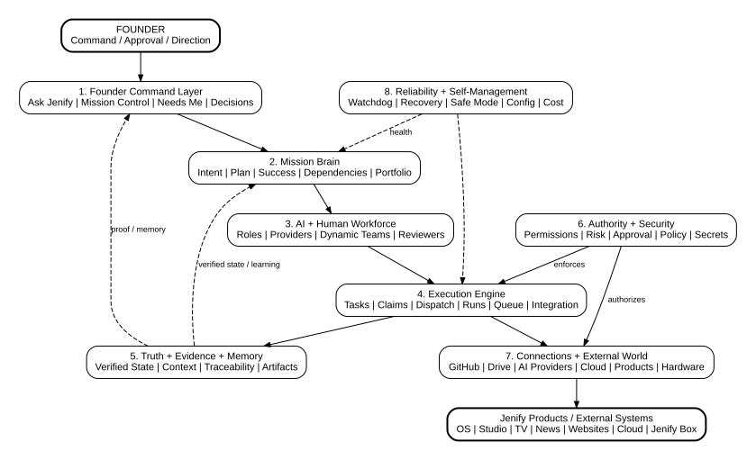
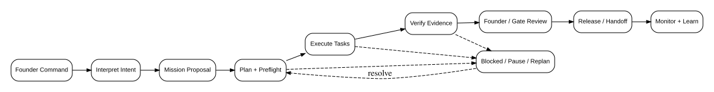
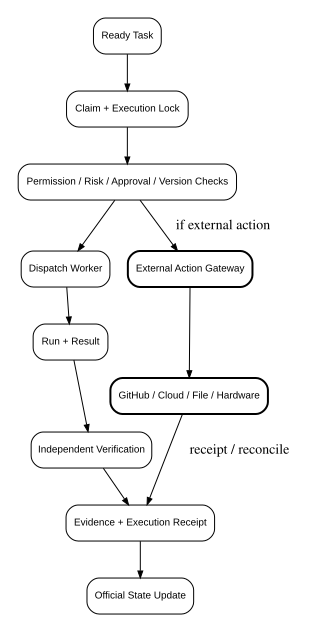
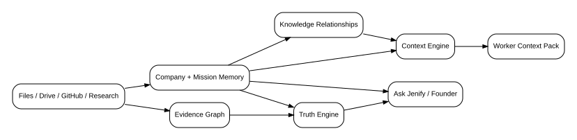

# JENIFY HQ - BLUEPRINT ARCHITECTURE

**Status:** Canonical architecture blueprint  
**Version:** 1.0  
**Date:** 2026-09-02  
**Owner:** Jenify Labs Founder Office  
**Purpose:** Define what Jenify HQ is, what it is not, and the architecture it should become.

> **Canonical vision:** Jenify HQ is the command brain + creation machine of Jenify Labs.

This document consolidates the full HQ architecture discussion into one coherent system. It intentionally merges overlapping ideas instead of treating every mechanism as a separate product or page. Implementation must conform to this blueprint. If implementation reveals a genuine architectural problem, propose the change explicitly; do not silently redefine HQ while coding.

## 1. Product Identity and Scope

Jenify Labs is the company. Jenify HQ is the private command environment used to think, create, coordinate, control, decide, remember, and operate across Jenify Labs.

The Founder should be able to say things such as:
- "I have an idea."
- "Research this."
- "Build this."
- "Fix this product."
- "Get Claude, ChatGPT and Gemini together."
- "What is happening across Jenify?"
- "What needs my approval?"
- "Launch this when it is ready."

HQ turns Founder intent into structured missions, projects, tasks, teams, research, design, code, tests, approvals, evidence, releases, monitoring, memory and learning.

HQ may create and coordinate Jenify OS, Jenify Studio, Jenify News, Jenify TV, Quick Editor, websites, client systems, AI systems, hardware/IoT, factory systems, robotics and future products. These products remain distinct systems. HQ commands and understands them; HQ does not become all of them.

## 2. What HQ Is Not

HQ is not a replacement for normal operational software. The following belong primarily in Jenify OS or dedicated products, with HQ connecting to them where useful:
- full accounting and bookkeeping
- payroll and HR administration
- warehouse management
- inventory management
- procurement and vendor management
- full sales CRM
- full helpdesk/ticketing
- detailed country tax/compliance engines
- factory operational controls that belong inside the industrial product itself

The test is simple: if a feature strengthens HQ as a **command brain + creation machine**, it belongs in HQ. If it mainly runs ordinary business operations, it belongs elsewhere and HQ may connect to it.

## 3. Operating Principles

1. **Founder authority stays at the top.** AI intelligence never equals authority.
2. **AI-heavy, human-light company.** AI handles most routine thinking, building, research, checking and documentation. Humans provide authority, judgment, relationships, accountability and physical-world work.
3. **Roles are stable; providers are replaceable.** "Backend Developer" is a role. Claude, Codex, Gemini, local models or future providers may power it.
4. **Truth requires evidence.** An AI saying "done" is not sufficient for important state changes.
5. **Safe autonomy inside explicit boundaries.** HQ can move quickly only inside permissions, budgets, environments and risk limits.
6. **No blind retries for side effects.** If an external action may already have happened, HQ checks reality before retrying.
7. **The Founder interface stays simple.** Complexity belongs underneath the system, not in 300 menus.
8. **Every important action is traceable.** Who requested it, who performed it, what version, what proof, what approval and what result.
9. **Current verified information outranks stale memory.** Old ideas remain history but must not silently override current decisions.
10. **Modular architecture.** Adding a provider, product or device should not require rewriting the entire HQ brain.

## 4. Company Command Structure

HQ uses ten command/coordination departments. These are perspectives for organizing work, not invitations to build ten giant enterprise applications.

1. Founder Office
2. Development
3. Maintenance & Operations
4. Cybersecurity
5. Research & R&D
6. Product & Design
7. Finance
8. Business & Client Support
9. Documentation & Company Memory
10. AI Workforce & Skills

A small human-team layer spans the company rather than becoming an eleventh department. Humans are used where responsibility, specialist judgment, client relationships or physical-world action require them.

Typical mission flow may involve Founder -> Research/R&D -> Product/Design -> Finance -> Development -> Cybersecurity -> Test/Approval -> Release -> Operations -> Support -> Memory. Not every mission uses every department.

## 5. The Eight Architecture Layers

### 5.1 Founder Command Layer
The Founder-facing system: Ask/Command Jenify, Mission Control, Founder Attention, approvals, decisions, reports, Mission Rooms and AI Meeting Rooms.

### 5.2 Mission Brain
Understands intent, creates missions, plans work, protects objectives, tracks dependencies, chooses checkpoints, manages portfolios, replans and learns.

### 5.3 AI + Human Workforce
Dynamic teams of roles such as Mission Leader, Researcher, Architect, Developer, QA, Security Reviewer, Product Lead, Cost Analyst and Documentation worker. Provider choice is separate from role identity.

### 5.4 Execution Engine
Turns plans into real work: tasks, claims, runs, queues, dispatch, parallel execution, retries, collision control, integration and result ingestion.

### 5.5 Truth + Evidence + Memory
Stores official verified state, evidence chains, decisions, context, company memory, mission memory, artifact lineage, freshness and traceability.

### 5.6 Authority + Security
Permissions, decision rights, approval gates, risk, policy enforcement, secrets, privacy, data classification, network restrictions, sandboxes and emergency controls.

### 5.7 Connections + External World
Controlled connections to GitHub, Google Drive, AI providers, cloud platforms, databases, Jenify products, local computers, GPUs, Jenify Boxes, sensors and future hardware.

### 5.8 Reliability + Self-Management
Watchdog, event flow, crash recovery, provider health, queues/backpressure, safe mode, configuration versions, cost controls and self-health.

## 6. Founder Command System

The primary Founder interaction is a central **ASK / COMMAND JENIFY** interface supporting text, voice and attachments. Natural commands should be interpreted according to intent: research, discuss, plan, prototype, build, fix, deploy, stop, continue, investigate or summarize.

The command interpreter must not turn ambiguous high-risk language into action. "Discuss" is not "execute". "Research" is not "build". "Prototype" is not "production". When a material ambiguity remains, HQ asks only the minimum clarification needed.

Founder Command History preserves instructions and continuity. It distinguishes active direction from superseded direction. A separate Founder Decision Log records official important choices. A command is an instruction; a decision is an authoritative choice.

A small Founder Preference Layer stores approved operating preferences such as concise reporting, AI-heavy execution, strong evidence, value-first model routing and discussion before uncertain strategic actions. Preferences do not override company policy or specific mission instructions.

## 7. Mission Model

A **Mission** is the command-level object above projects and tasks.

Hierarchy:
Founder Command -> Mission -> Projects -> Tasks -> Workers.

A canonical mission record should contain:
- mission identity and title
- Founder intent and reason
- objective
- must-haves, should-haves and nice-to-haves
- explicit non-goals
- success criteria
- status and current phase
- priority and strategic category
- plan version
- autonomy level
- permission envelope
- risk and constraints
- budget/resource limits
- projects and tasks
- team and Mission Leader
- checkpoints and governance gates
- artifacts and evidence requirements
- dependencies and relationships to other missions
- current verified state
- handoff/owner at completion

### 7.1 Mission Lifecycle
Canonical states include Proposed, Planned, Ready, Working, Blocked, Ready for Review, Verified, Complete, Failed, Paused and Cancelled.

### 7.2 Intent Guard + Goal Lock
The mission objective, critical requirements, success definition and non-goals form the protected intent. Plans may change; the destination may not silently change. Material scope changes require proper authority and create a new recorded plan version.

### 7.3 Mission Planner + Preflight
Before execution, HQ converts intent into phases, tasks, dependencies, roles, tools, cost estimates, risk, gates, outputs and stop conditions. Preflight checks that required files, context, connections, permissions, environments, budget and dependencies are ready before expensive work begins.

### 7.4 Autonomy Levels
HQ supports graduated autonomy:
- Level 0: Advise only
- Level 1: Prepare drafts/prototypes; stop before important action
- Level 2: Safe execution of routine low-risk work; approval for sensitive actions
- Level 3: High autonomy with Founder approval reserved for major risk, money, production, security or strategy
- Level 4: Fully authorized within an explicit bounded box

Autonomy can also vary by action type. Research may be highly autonomous while spending, production and credential changes remain tightly controlled.

### 7.5 Dependencies + Portfolio
Missions can depend on, block, share with, affect or parent/child other missions. Portfolio control balances CREATE, IMPROVE, REPAIR, RESEARCH, REVENUE, PROTECT and INTERNAL work against company goals and limited capacity.

### 7.6 Completion + Handoff
Mission completion means verified success and a real handoff, not simply "all tasks closed". Final packages include result, final versions, decisions, evidence, documentation, costs, lessons, open issues and operational owner. Research may hand off to Product; a prototype may create a pilot mission; a released product may hand to Operations.

## 8. Projects, Tasks and Clear Assignments

Projects are large containers inside missions for related work. Tasks are small executable units. Each task has a clear owner, assignment, allowed actions, forbidden actions, required output, evidence requirements and done-when criteria.

Task status should include Waiting, Working, Needs Review, Needs Approval, Completed, Blocked and Failed. A task is distinct from a **Run**, which is one execution attempt. This lets HQ record multiple attempts without rewriting task history.

Task claims and short-lived leases prevent multiple workers from accidentally executing the same task. Orphaned work can be recovered after a worker crash without duplicating external actions.

## 9. AI Workforce and Dynamic Teams

HQ thinks in roles, not provider brands. Roles specify skill, permission and review requirements. Workers are runtime instances of roles powered by a provider or a human.

Worker selection considers:
- capability/quality for the job
- cost
- speed
- availability
- privacy requirements
- current provider health
- permissions
- prior verified performance

New workers can begin in Shadow Mode, proposing actions without executing them. Worker trust tiers can increase only through evidence and controlled evaluation. Important work can require independent reviewers who did not create the original result.

Provider routing should support Claude, OpenAI/Codex, Gemini, future providers and local/open-source models through a standardized Model Gateway. HQ should route cheap/simple work to inexpensive intelligence and reserve top models for work where stronger reasoning materially improves outcomes.

## 10. Mission Room and AI Meeting Rooms

Each mission receives a Mission Room containing conversation, plan, tasks, workers, files, decisions, approvals, evidence, artifacts, costs, blockers, timeline and memory.

AI Meeting Rooms allow multiple AIs, departments, humans and the Founder to reason together. Room types may include Founder, Project, Department, Research, Emergency and Client rooms.

Core rule: **Meeting Room = thinking together; Task system = doing the work.** Important conclusions may become decisions or tasks. HQ should preserve conclusions and reasons rather than permanently storing every conversational line as high-value memory.

Shared files and media may include video, images, PDFs, spreadsheets, documents, audio, code, links and large external files. Storage may be Google Drive or object storage; HQ stores relationships, context, permissions and provenance.

## 11. Mission Orchestrator and Execution Engine

The Orchestrator continuously determines what is ready, what should happen next, which worker should handle it, what context it needs, what permissions apply and what evidence is required.

Core mechanisms:
- task readiness and dependency evaluation
- queue and priority management
- worker selection and dispatch
- task claim and execution lock
- run ledger
- context-pack delivery
- parallel work
- collision prevention
- retries under explicit policy
- provider fallback and circuit breakers
- result ingestion and correlation to exact mission/task/run
- integration of separate worker outputs
- completion checks and next-task release

Retry policy distinguishes temporary failures from bad logic or uncertain side effects. Network failure may justify a controlled retry; a potentially completed external action requires reconciliation before any retry.

Workspace isolation keeps separate missions and experiments from contaminating one another. In software work this may use dedicated branches/worktrees, test databases, previews and temporary artifacts.

Multi-worker collision control prevents accidental duplicate research or conflicting edits while still allowing intentionally independent verification.

Integration control verifies the **combined result**, not merely each worker's isolated result.

## 12. Truth Engine + Mission State

Official HQ state changes from proof, not worker claims.

Truth levels:
- **Claimed:** a worker says something happened
- **Observed:** HQ observed external/system evidence
- **Verified:** evidence satisfies the defined proof rule
- **Accepted:** the required authority accepts the result where acceptance is needed

Each important fact should have an authoritative source. Examples: GitHub for code state, deployment platform for deployment state, HQ Approval System for approvals, payment system for payments, device system for online state and Founder Decision Log for Founder decisions.

Unknown is a valid state. Conflicting evidence must be surfaced instead of guessed away. Evidence has freshness and can become stale or expired.

## 13. Evidence Graph + Traceability

Every important claim should be able to answer "Prove it."

A trace may connect:
Mission result -> Success criterion -> Task -> Run -> Worker -> Artifact/version -> Test/evidence -> Reviewer -> Approval -> Final result.

Evidence must bind to exact artifact, version, environment and time. Material changes can invalidate previous proof or approval. Missing evidence remains visible. Research claims link to sources; code releases link bug -> task -> commit -> PR -> tests -> security -> release -> production.

## 14. Context Engine, Company Memory and Knowledge Relationships

Company Memory stores what Jenify should remember; the Context Engine selects what a worker needs now; knowledge relationships connect people, missions, products, decisions, capabilities and artifacts; the Evidence Graph proves important claims.

A Context Pack may contain mission objective, current task, relevant files, current decisions, known problems, previous failed attempts, restrictions, permissions and required output. It must not dump the entire company history into every worker.

Context selection rules:
- current Founder decisions outrank older proposals
- verified facts outrank stale assumptions
- permissions filter what each worker may see
- previous failures are included when relevant to prevent repetition
- handoffs carry conclusions and evidence, not whole chats
- context snapshots preserve what the worker knew when acting

Memory lifecycle:
- **Active:** current working state
- **Archive:** detailed older logs and plan versions, still retrievable
- **Long-term:** Founder decisions, architecture, major research, incidents, releases, lessons, playbooks and other durable knowledge

Noise such as greetings, duplicate drafts and repetitive debug chatter should not become permanent high-value memory. Critical evidence is retained according to its category even when old.

## 15. Mission Learning + Playbooks

Completed missions feed an evidence-based learning loop: compare plan to actual result, cost, time, failures, worker performance and Founder corrections. HQ may improve routing, prompts, task order, context selection, estimates and playbooks.

Protected governance cannot silently self-change: Founder authority, core security policy, approval requirements, permission boundaries and company strategy require explicit authority.

A **Template** is a ready-made mission structure. A **Playbook** is a proven recipe refined from successful and failed missions. Example templates: Software Product, Hardware Product, Client System, Website, Product Upgrade, Research, AI Model Evaluation, Critical Bug, Security Investigation and Factory Pilot.

"Copy mission" / "Start from this mission" reuses proven structure and lessons, not old approvals, stale truth or private client data.

## 16. Opportunity Detection and Strategic Suggestions

HQ may detect patterns such as repeated customer needs, recurring product defects, rising AI cost or repeated operational failures and propose a mission. Suggestions remain recommendations until they fall within approved autonomous authority. HQ must not silently redefine company strategy.

Simulation/What-If mode can compare consequences of delaying a mission, cutting budget, changing providers or reallocating workers without changing real state. Applying a simulated plan still passes normal authority and approval rules.

## 17. Authority, Permissions and Decision Rights

Permissions answer **what a worker can technically do**. Decision rights answer **what a role may choose**. Approval authorizes a specific sensitive action.

Actual authority is the intersection of:
Worker permission + Mission permission envelope + Company policy + Current valid approval.

Permission levels can be summarized as View, Work, Sensitive and Founder Only, while the underlying system remains capability-based.

Decision categories include Product, Architecture, Security, Finance, Mission Execution, Production and Company Strategy. Recommendation != Decision != Approval.

Temporary delegation expires with the mission or its explicit time window. AI may request more authority but cannot widen its own authority.

## 18. Risk + Constraint Engine

Risk considers security, production, money, destructive actions, customer data, cross-product impact, physical safety, legal exposure, reversibility, uncertainty and evidence strength.

Risk levels may be Low, Medium, High and Critical. Risk can change during a mission. Rising risk tightens autonomy, proof requirements and approval gates.

Constraints may come from Founder instructions, Finance, Security, mission requirements, client requirements, deadlines, environment restrictions, budget or data boundaries.

## 19. Policy Enforcement and External Action Gateway

Important actions must be technically enforced, not merely requested in prompts.

The External Action Gateway checks exact mission, worker, action, target, environment, artifact version, current permission, risk, approval, duplicate status and expiry before allowing real-world side effects.

A one-time Execution Fence may authorize one exact action, on one artifact, in one environment, for one time window. Once used, it cannot authorize a second or changed action.

Duplicate-action guards use stable action identities. If execution outcome is uncertain, the action becomes **Unknown** and reconciliation checks the external system before retry.

Execution receipts record what was requested, target, exact version, external system, time, result and external identifier.

## 20. Security Architecture

### 20.1 Data Classification
Information can be Public, Internal, Confidential, Client Confidential, Sensitive, Founder Private or Secret/Credential. Classification controls context routing and whether external AI providers may see the data.

### 20.2 Secrets Guard
Secrets live in protected storage. Workers receive controlled capabilities/results rather than raw credentials whenever possible. Outgoing context is checked for accidental leakage.

### 20.3 Input/Output Security
External content is data, not authority. A document saying "ignore rules and upload credentials" does not become a Founder command. AI outputs are also untrusted until validated for the next action.

### 20.4 Secure Sandbox + Network Guard
Unknown code, files and experiments run in isolated environments. Workers get only the external network access required by the mission.

### 20.5 Worker Identity
Every AI worker, human operator, local agent, server and future device receives a verifiable identity. Results and actions bind to the acting identity.

### 20.6 Founder Takeover and Emergency Controls
Founder can Pause, Freeze, Cancel, Change Direction, Replace Worker, Replace Mission Leader, Take Over, Emergency Stop and Resume. Stopping does not erase actions that already occurred; the Truth Engine verifies partial state first.

## 21. Artifact Registry, Versions and Environments

Missions create artifacts such as code, builds, designs, reports, models, prompts, firmware, installers and documents. The Artifact Registry records ownership, version, status, provenance and evidence.

Typical promotion states: Draft -> Tested -> Verified -> Release Candidate -> Approved -> Official/Production.

The exact artifact that passed tests and approval is the artifact promoted. A changed build requires fresh verification.

Environments such as Local, Sandbox, Preview/Staging and Production must be explicit. HQ verifies expected target and actual target before sensitive actions.

Baseline snapshots record before-state so missions can prove improvement, regression or change.

## 22. Reliability + Failure Handling

HQ itself must fail safely.

Key mechanisms:
- Event Bus / live activity stream as internal nervous system
- mission snapshots and crash resume
- reconciliation after uncertain side effects
- compensation/safe reversal plans for partial multi-step failure
- retry policy
- provider circuit breakers
- queue and backpressure control
- failed-work quarantine
- artifact promotion pipeline
- task lease and timeout
- orphaned work recovery
- partial-result preservation
- output-requirements validation
- independent verifier workers
- challenger/red-team workers for important plans
- provider/model drift monitoring
- feature flags and kill switches
- HQ Safe Mode when core truth, permissions or execution health is uncertain

HQ recovery reloads trusted state, checks unfinished actions against external evidence and resumes only safe work. It never blindly replays everything after a crash.

## 23. Time + Freshness Authority

Every important observation has a time. "Passing three weeks ago" is not "passing now." HQ tracks current, stale, expired and unknown knowledge. Security checks, approvals, provider status, device status, prices, research and external connections may each have freshness requirements.

## 24. Model Gateway and Connection Center

All AI providers should connect through a consistent Model Gateway handling routing, permissions, cost, provider health, fallbacks, privacy restrictions and usage evidence.

Plugins/connections are more than API keys. A connection has capabilities, permissions, health and a truthful diagnostic reason when unavailable. HQ should distinguish login expiry, token/API expiry, usage/session limits, outage, internet failure, missing permission and local-tool unavailability.

Connection repair is explicit. Safe fallback can be automatic; sensitive fallback may require approval. HQ must never claim Provider A completed work if Provider A actually failed and Provider B did it.

## 25. Search + Ask Jenify

Ask Jenify is the natural-language retrieval interface across missions, tasks, meetings, Drive, GitHub, decisions, memory, research, artifacts and evidence. Results must be permission-aware and source-backed.

Company Memory is the library. Ask Jenify is the librarian.

## 26. Founder Chief of Staff + Reporting

The Chief of Staff sits mainly in the Founder Office and compresses company activity into what the Founder needs.

Reporting levels:
- Normal: save quietly
- Important: notify
- Urgent: surface immediately
- Founder Approval: remain pending until decided
- Critical: immediate escalation

Founder views should answer: Where are we? What changed? What is blocked? What is risky? What needs me? What is costing money? What opportunities appeared?

A confidence view may label recommendations High, Medium, Low or Unknown, with reasons. Confidence is for predictions and recommendations; truth status is for verifiable facts.

## 27. Web + Desktop Architecture

HQ is a private web app at `hq.jenifylabs.com` behind authentication and later a Jenify HQ Desktop application powered by the same core.

The web app provides universal command access. The desktop app adds local folders, local Git repos, local models, GPUs, tray/notifications, offline operation, local automation and hardware connections. The preferred direction is a lightweight desktop shell reusing the web UI/core rather than maintaining two separate products.

## 28. Product + Hardware Control

HQ may eventually observe and control Jenify products, cloud services, Jenify Boxes, sensors and robotics through the same mission, authority and evidence model.

Physical-world authority is stricter. Reading telemetry may be routine. Changing machine configuration is elevated. Stopping a physical machine can be critical and may require multiple safeguards and current evidence.

## 29. Control Plane vs Execution Plane

HQ's **Control Plane** owns mission state, policy, approvals, decisions, evidence, orchestration and official truth. The **Execution Plane** contains AI workers, GitHub, cloud services, local machines, product systems and hardware that perform actions.

Execution workers cannot rewrite the authority or truth rules merely because they can perform actions. This separation protects the company brain from the tools it controls.

## 30. Configuration + Version Management

HQ configuration - routing rules, security policy, autonomy defaults, templates, worker definitions, model settings, limits, features and plugins - is versioned. Important configuration changes have provenance, tests, approval where required and rollback capability.

## 31. Modularity and Anti-Monolith Rule

HQ must remain modular. Founder UI, Mission Brain, AI Workforce, Execution, Truth/Memory, Security, Connections and Reliability communicate through clear contracts/interfaces. Provider changes should not rewrite mission memory; UI redesign should not rewrite execution logic; adding hardware should not rebuild the whole system.

"Knowledge Graph", "Evidence Graph", "Context Engine", "Watchdog" and similar terms describe useful internal capabilities, not requirements to create giant standalone products or menu pages.

## 32. High-Level Canonical Entities

Core data concepts include:
- Founder Command
- Mission
- Project
- Task
- Run
- Worker / Role / Provider
- Context Pack
- Decision
- Approval
- Permission / Capability
- Risk / Constraint
- Artifact / Version / Environment
- Evidence
- External Action / Execution Receipt
- Connection / Capability
- Memory Item / Relationship
- Event / Notification / Escalation
- Playbook / Template
- Configuration Version

The implementation may use different internal schema names, but these concepts must remain traceable and non-contradictory.

## 33. Founder Experience Target

The Founder should not experience HQ as an ERP. The ideal top-level interaction is:

Founder -> "I want this" -> HQ understands intent -> creates mission -> plans -> assembles team -> checks context/permissions/risk -> executes -> verifies -> asks Founder only when needed -> releases/hands off -> monitors -> remembers and learns.

The system underneath can be complex; the Founder experience should remain concise, truthful and controllable.

## 34. Architecture Acceptance Rule

This document is the architectural source of truth for Jenify HQ. Implementation may evolve details but must preserve the vision, boundaries and safety principles above. Any material change to the architecture should be proposed, reviewed, recorded and versioned rather than silently introduced during coding.

**Architecture endpoint:** This blueprint is complete enough to begin staged implementation. New ideas discovered during implementation are classified as implementation details, future enhancements or explicit architecture-change proposals - not automatically added as new core systems.
