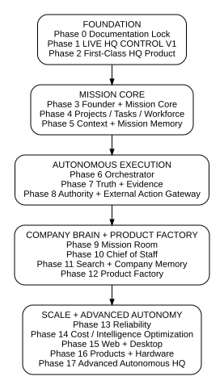

# JENIFY HQ - IMPLEMENTATION MASTER PLAN

**Status:** Canonical implementation roadmap  
**Version:** 1.0  
**Date:** 2026-09-02  
**Depends on:** JENIFY HQ - BLUEPRINT ARCHITECTURE  
**Purpose:** Define how the existing HQ codebase becomes the full Jenify HQ without restarting, drifting or building future systems before the foundation is proven.

> **Implementation rule:** Every phase must leave a working, tested and evidenced HQ that is stronger than the previous phase.

## 1. Authority Order

1. **Blueprint Architecture** - what HQ is and what it must become.
2. **Implementation Master Plan** - how it is built and in what order.
3. **Current Status** - where implementation currently stands.
4. **Code and evidence** - the actual implementation state.

Coding agents must read the Blueprint, this plan and Current Status before performing HQ work. If code and documentation conflict, do not guess. Surface the conflict and resolve it deliberately.

## 2. Current Starting Point

HQ already exists as a substantial package inside the `kiniena-github/JENIFY-OS` repository. It has source, tests, connectors/providers, live control, operator logic, memory and UI structures. The plan therefore **builds forward from verified existing work** instead of creating a new HQ from scratch.

As of 2026-09-02:
- `main` remains at merge commit `85184a3be819fe1dede2f320cf43c6bad8603a6e`.
- PR #228 is open and unmerged at head `52d057fea90b716a81921f5774a51057a28195c8`.
- PR #228 contains the current LIVE HQ CONTROL V1 correction round for Connection Center truth and expired-approval recovery.
- Latest exact-head CI run is still failing because of an unrelated date-sensitive server test; HQ local tests/typechecks had passed in the correction round.
- LIVE HQ CONTROL V1 has not yet passed all Founder-workstation proof gates and is not accepted as Final V1.

No production deployment, destructive rollback, force push, credential change or blind external retry is part of the immediate plan.

## 3. Delivery Method for Every Phase

Each phase follows the same evidence-driven loop:

Design -> small implementation scope -> one active builder -> independent review -> automated tests -> real browser/workstation proof where relevant -> evidence capture -> Founder acceptance -> merge -> status update.

Rules:
- do not merge because an AI says "done"
- do not combine unrelated fixes into one correction round
- do not silently widen scope
- do not use production for proof when preview/local proof is sufficient
- no blind retry of potentially side-effecting external actions
- bind tests/approval/evidence to exact artifact and commit/version
- update Current Status after every accepted milestone

## 4. Phase 0 - Documentation Lock

### Goal
Create the canonical documentation package and make coding agents aware of it.

### Deliverables
- `JENIFY-HQ-BLUEPRINT-ARCHITECTURE.md`
- `JENIFY-HQ-IMPLEMENTATION-MASTER-PLAN.md`
- `JENIFY-HQ-CURRENT-STATUS.md`
- human-readable DOCX/PDF versions of the Blueprint and Implementation Plan
- architecture diagrams
- a short HQ instruction section in `CLAUDE.md` pointing agents to the three canonical MD files

### Rules
The Blueprint is authoritative. The Implementation Plan cannot silently redefine architecture. Current Status contains live implementation facts and next action, not long-term design.

### Exit Gate
Documents exist, agree with each other, are reviewed, and the repo contains the machine-readable canonical versions on an approved documentation branch/PR.

## 5. Phase 1 - Finish LIVE HQ CONTROL V1

### Goal
Prove the first safe end-to-end Founder control lane: Founder -> HQ -> approval -> worker -> external system -> result -> evidence.

### Current focus
PR #228 correction branch `ai/225-connection-center-dispatch-truth` at exact head `52d057f...`.

### Required work sequence
1. Create a new isolated proof worktree at exact corrected SHA `52d057f...`; keep the original pristine proof worktree untouched.
2. Copy proof databases into a new proof directory so historical evidence remains preserved.
3. Rebuild HQ site/server at the corrected SHA.
4. In real Edge, prove `/hq/connections.html` reports CLAUDE truth consistently with Command Center.
5. On the copied DB, perform the intentional non-check dispatch against the expired approval. Expected result: GitHub dispatch is refused, no external side effect occurs, and the canonical HQ task returns to `needs_approval` through the approved recovery path.
6. Use the second Founder identity in the browser for fresh approval.
7. Run check-only and prove ELIGIBLE + CLAIMABLE, authenticated GitHub transport, and no dispatch side effects.
8. Resolve/clear exact-head CI before Final V1 acceptance. The unrelated wall-clock server test should receive a narrow test-only fix only with explicit direction; do not alter business logic merely to make CI green.
9. Review the real adapter path and perform exactly one harmless real GitHub dispatch.
10. If any error could represent partial publication, stop and inspect GitHub/evidence before retrying.
11. Prove designated worker claim/fence, durable evidence, duplicate/retrigger refusal and correct action identity.
12. Inspect result-ingest/correlation path before ingesting the legitimate result.
13. Prove result returns to the exact mission/task/run and that preview-ready evidence is complete.
14. Founder accepts Final V1 only after all gates pass.

### Exit Gate
A real Founder browser action can safely create/approve a task, dispatch exactly one harmless external action through the designated worker, bind the action to one-time authority, receive the correct result and produce durable evidence without duplicate or unauthorized side effects.

## 6. Phase 2 - Make HQ a First-Class Jenify Product

### Goal
Remove historical conceptual coupling that treats HQ as merely part of Jenify OS while preserving working implementation.

### Work
- inventory HQ dependencies on shared Factory/Jenify OS packages, auth, server, DB, UI and tooling
- identify genuinely shared libraries versus accidental coupling
- define target repo/package/service boundaries
- migrate in small verified steps
- keep backwards compatibility where useful during extraction
- avoid rewrite-for-rewrite's-sake

### Exit Gate
HQ can build, test, run and deploy as Jenify HQ with its own product identity and clear interfaces to Jenify OS and shared libraries.

## 7. Phase 3 - Founder Command + Mission Core

### Goal
Turn natural Founder intent into a canonical Mission object and simple Mission Control UI.

### Build
- Ask / Command Jenify input
- command interpreter with safe clarification
- Founder Command History
- Founder Decision Log foundation
- Mission entity and lifecycle
- intent, objective, non-goals and success criteria
- priority, risk, autonomy and permission-envelope references
- mission state and phase
- pause/resume/cancel/change-direction controls
- active missions, blocked, needs-me and recent-change views

### Exit Gate
Founder can create, inspect, pause, change direction and close a real mission through HQ without direct database/manual code intervention.

## 8. Phase 4 - Projects, Tasks + Dynamic AI Workforce

### Goal
Make missions executable by structured tasks and provider-independent worker roles.

### Build
- Project and Task entities
- clear assignment fields: worker, job, allowed/forbidden actions, required output, evidence and done-when criteria
- task status model
- Run/attempt model
- roles: Mission Leader, Researcher, Architect, Developer, QA, Security Reviewer, Product/Design, Cost Analyst, Documentation
- Worker identity and provider binding
- provider-neutral worker selection interface
- basic task ownership and claim

### Exit Gate
A mission can create structured tasks, assign roles and assemble a small AI team without hardcoding the company around one provider brand.

## 9. Phase 5 - Context Engine + Mission Memory

### Goal
Give each worker the right information while making missions survive across sessions.

### Build
- Context Pack schema
- permission-aware retrieval
- current-decision priority over old proposals
- previous-failure inclusion
- context snapshots per run
- Mission Memory: Active, Archive, Long-Term
- file/reference relationships
- initial Company Memory interface
- Google Drive as optional heavy-file backend, with HQ retaining context and provenance

### Exit Gate
Workers receive controlled relevant context and a mission can continue correctly after a new session without relying on the original chat history.

## 10. Phase 6 - Real Mission Orchestrator

### Goal
Allow HQ to advance a multi-step mission without the Founder manually commanding every task.

### Build
- dependency readiness evaluator
- queue and priority system
- task claim/lease
- worker dispatch
- run ledger
- result ingestion/correlation
- parallel task execution
- collision control
- retry policies
- provider fallback and circuit breaker
- orphaned work recovery
- integration checks
- preflight readiness

### Exit Gate
A mission with several dependent and parallel tasks can advance automatically while respecting worker ownership, failures and dependencies.

## 11. Phase 7 - Truth + Evidence Engine

### Goal
Make official HQ state evidence-driven.

### Build
- Claimed / Observed / Verified / Accepted state model
- authoritative-source mapping
- evidence object and version binding
- success-criterion proof rules
- freshness/staleness
- Evidence Graph / traceability chain
- "Prove It" interface
- baselines and before/after comparison
- immutable/versioned evidence references where practical

### Exit Gate
Important mission results cannot become Verified/Complete unless their defined evidence rules are satisfied.

## 12. Phase 8 - Authority, Risk + External Action Gateway

### Goal
Make AI autonomy technically bounded rather than prompt-dependent.

### Build
- capability-based permissions
- decision-rights map
- Mission Permission Envelope
- risk/constraint engine
- policy enforcement point
- approval scope and expiry
- one-time execution fence
- External Action Gateway
- duplicate-action identity
- execution receipts
- environment/version target checks
- data classification
- secrets abstraction
- safe sandbox/network restrictions

### Exit Gate
A worker cannot execute a sensitive real-world action unless mission, worker, policy, risk, approval, target and version all permit that exact action.

## 13. Phase 9 - Mission Room + Multi-AI Collaboration

### Goal
Create one coherent workspace where reasoning, tasks, files, evidence and decisions meet.

### Build
- Mission Room timeline
- threaded AI collaboration
- AI Meeting Rooms
- files/media references
- conversation -> task/decision conversion
- worker presence/status
- blocker panel
- evidence panel
- Founder-only area

### Exit Gate
Multiple AIs can reason together around one mission and convert conclusions into structured work without turning HQ into a generic chat clone.

## 14. Phase 10 - Founder Chief of Staff + Command Center

### Goal
Compress company complexity into Founder attention.

### Build
- Normal / Important / Urgent / Founder Approval / Critical reporting levels
- Needs Me queue
- What Changed summary
- blocked/risky/cost attention cards
- Founder Decision Log maturation
- concise mission health
- confidence/uncertainty display
- scheduled Founder brief capability

### Exit Gate
Founder can understand company state and required decisions without reading raw worker activity.

## 15. Phase 11 - Search + Company Memory + Ask Jenify

### Goal
Make Jenify's knowledge retrievable with sources.

### Build
- unified search across missions/tasks/meetings/Drive/GitHub/memory/decisions/evidence/artifacts
- permission-aware retrieval
- source-backed answers
- current-vs-superseded handling
- relationship queries such as "what uses this?" and "who decided this?"

### Exit Gate
Ask Jenify can answer important company questions from real sources without treating old brainstorming as current truth.

## 16. Phase 12 - Product Factory

### Goal
Turn repeatable Jenify work into templates and proven playbooks.

### Build
Mission templates for Software Product, Website, Client System, Hardware Prototype, Research, Product Upgrade, Critical Bug, Security Investigation, Factory Pilot and AI Model Evaluation.

Add playbook learning, copy/start-from-this-mission, reusable gates, default roles, expected artifacts and success criteria. Cloned missions receive fresh identity, permissions, approvals and evidence.

### Exit Gate
Founder can issue a short command such as "prototype it" and HQ creates an appropriate mission structure using proven Jenify methods.

## 17. Phase 13 - Advanced Reliability + Self-Protection

### Goal
Make long-running multi-mission operation fail safely.

### Build
- Watchdog and mission heartbeat
- event bus/live activity stream
- crash snapshots/resume
- reconciliation
- compensation/safe reversal
- queue backpressure
- failed-work quarantine
- provider health and model drift
- feature flags/kill switches
- HQ Safe Mode
- configuration versioning/rollback
- control-plane recovery

### Exit Gate
Failures degrade safely and uncertain states pause rather than producing uncontrolled duplicate or destructive actions.

## 18. Phase 14 - Cost + Intelligence Optimization

### Goal
Automate value-first AI routing.

### Build
- cost accounting per run/mission/provider
- capability benchmark registry
- worker quality history
- latency/reliability history
- routing by quality, cost, privacy, speed and risk
- local/open-source model support where quality is sufficient
- high-intelligence routing for strategically important tasks

### Exit Gate
HQ can explain why it selected a provider and show quality/cost trade-offs from evidence rather than brand preference.

## 19. Phase 15 - HQ Web + Desktop

### Goal
Offer web access and deep local power from the same core.

### Build
- mature private web app at `hq.jenifylabs.com`
- reusable UI/core boundary
- desktop shell (likely Tauri unless implementation evidence recommends another option)
- local folders and repos
- local model/GPU access
- notifications/tray
- offline/local operation
- secure local bridge to HQ core

### Exit Gate
Web and Desktop operate as two controlled interfaces to the same mission/authority/truth system.

## 20. Phase 16 - Jenify Product + Hardware Control

### Goal
Extend the same command model to Jenify products and physical systems.

### Build
- capability connectors for Jenify OS, Studio, TV, News and future products
- Jenify Box/device identities
- telemetry observation
- hardware command policy
- stricter physical-action gates
- current-state verification before and after commands

### Exit Gate
HQ can observe and safely perform selected authorized product/hardware actions with evidence and no separate ad-hoc control model.

## 21. Phase 17 - Advanced Autonomous HQ

### Goal
Reach the long-term AI-heavy company operating model.

### Capabilities
- detect problems/opportunities
- propose missions
- start permitted routine missions
- dynamically assemble teams
- replan inside authority
- optimize providers/cost
- monitor products
- maintain systems
- learn from mission outcomes
- escalate only what requires Founder judgment

### Exit Gate
Founder interaction becomes primarily: "Build this", "What needs me?", "Why did this happen?", "Approve", "Change direction", "Stop" and "Continue", while HQ safely handles the lower-level machinery.

## 22. Milestone Grouping

### Foundation Milestone
Phases 0-2. Documentation, proof of safe live control, first-class HQ product boundary.

### Mission Core Milestone
Phases 3-5. Founder commands become structured missions with tasks, workers, context and durable memory.

### Autonomous Execution Milestone
Phases 6-8. Orchestration, truth/evidence and hard authority make safe real work possible.

### Collaboration + Company Brain Milestone
Phases 9-12. Mission Rooms, Chief of Staff, search/memory and Product Factory.

### Scale + Advanced Autonomy Milestone
Phases 13-17. Reliability, optimization, desktop/local power, product/hardware control and advanced autonomy.

## 23. Build Priority Rule

Do not implement a later phase merely because it is exciting. A later capability may be pulled earlier only if it is a direct dependency or safety requirement for the current phase. When that happens, implement the smallest required slice and leave the full feature in its planned phase.

## 24. AI Worker Strategy During Implementation

For the near term:
- **Founder / ChatGPT architecture role:** maintain blueprint intent, define mission scope, review evidence and prevent drift.
- **Primary coding builder:** one Claude Code session/worker per correction round unless the plan explicitly assigns a different builder.
- **Independent review:** another capable AI or review path should inspect important changes independently of the builder.
- **Browser/workstation proof:** performed against exact code/version where UI or local integration matters.

Provider choices may evolve. The process matters more than the brand.

## 25. Git + Change-Control Rules

- branch from a verified base
- pin exact SHAs for proof-critical work
- one correction scope per branch/PR where practical
- do not auto-merge sensitive HQ changes
- do not rewrite/force history to hide mistakes
- preserve frozen evidence branches/worktrees
- separate documentation changes from risky runtime changes when useful
- merge only after defined gates and Founder acceptance

## 26. Definition of Done for a Phase

A phase is done only when:
1. defined scope exists in code/docs
2. automated tests pass or any unrelated failure is explicitly cleared and evidenced
3. security/permission rules pass
4. real UI/workstation proof passes where applicable
5. exact artifacts/versions are recorded
6. evidence is durable and reviewable
7. no known critical blocker remains
8. Current Status is updated
9. Founder accepts the phase when Founder acceptance is required

## 27. Immediate Next Actions

The next implementation sequence is deliberately small:

1. Finalize and review the Blueprint + Implementation Plan documentation package.
2. Create `JENIFY-HQ-CURRENT-STATUS.md` from live repository state.
3. Put the canonical MD files in the repo on an approved documentation branch/PR and wire the read-order into `CLAUDE.md`.
4. Return to Phase 1 and create the corrected isolated proof worktree at `52d057f...`.
5. Complete LIVE HQ CONTROL V1 evidence gates before building Phase 2.

No Phase 2 extraction or Phase 3 Mission UI expansion starts before Final V1 foundation acceptance unless explicitly re-planned.
